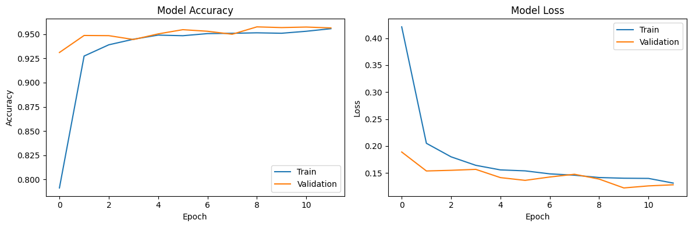

# Malaria Detection with Convolutional Neural Network

This project aims to develop a machine-learning model for detecting malaria from cell images using a Convolutional Neural Network (CNN). The dataset used for this project is the [Cell Images for Detecting Malaria](https://www.kaggle.com/iarunava/cell-images-for-detecting-malaria) available on Kaggle.

## Dependencies

- Python 3.x
- TensorFlow
- Keras
- scikit-learn
- Pillow
- matplotlib
- Kaggle API

## Dataset

The dataset consists of cell images categorized into parasitized and uninfected classes. The images are resized to 32x32 pixels.

## Model Architecture

The CNN model is designed with three convolutional layers followed by max-pooling layers. The final layer is a softmax layer for classification.

## Model Training and Evaluation
The model is trained with early stopping to prevent overfitting. The training history is visualized for accuracy and loss. The model is evaluated on a separate test set to assess its performance.

### Results

The project evaluates the model's accuracy and loss on both the training and validation sets, with 95% accuracy on both the training and validation sets.

## Credits
* Dataset: [Cell Images for Detecting Malaria](https://www.kaggle.com/iarunava/cell-images-for-detecting-malaria).
* [Belajar Pengembangan Machine Learning](https://www.dicoding.com/academies/185) Dicoding Indonesia.
